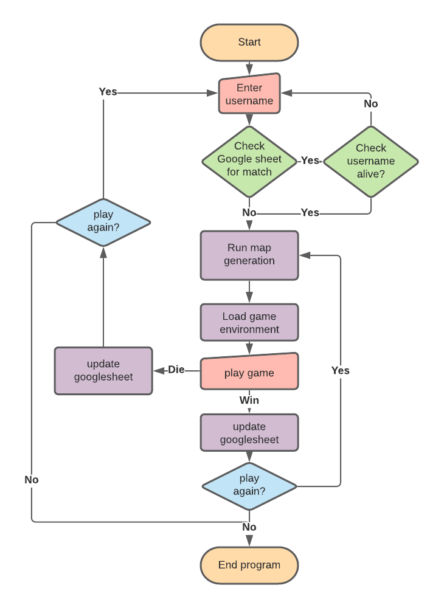
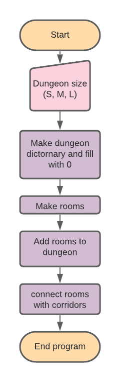
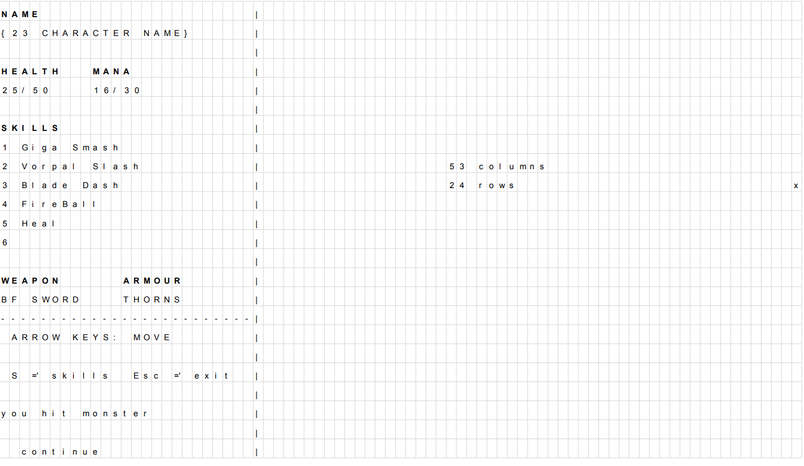

# Roguelike Dungeon Crawler Tribute  

## Overview  

Ever since my parents bought me HeroQuest as a young child, I have always had a special place in my heart for the venerable dungeon crawler game.  

I have played many games, including board games, many from GamesWorkshop including HeroQuest, Advanced HeroQuest, SpaceCrusade, WarhammerQuest, and others like Descent, Zombiecide and Darklight.  

As well as playing with friends on cardboard, I have also played many computer games, including the genre defining Rogue, and expanded experience, Angband.  

[The subreddit Roguelikes](https://www.reddit.com/r/roguelikes/)

[Click here to see the Angband webpage](https://rephial.org/)  

This program is a tribute to Rogue and roguelike games, and will exhibit a number of the features of the classic Rogue game, ascii art, random dungeons, and D&D inspired combat mechanics.

## Design features

The progam has a number of features that are inspired by the rougelike genre, to create a simple single level dungeon crawler:

1. Random map generation - Eachtime a game is started a new random map will be generated.
2. Character permadeath - Characters will be stored on a googlesheets document.
3. Simultaneous turn based gameplay - Each input from the user will progress the game 1 turn.
4. Feedback - The player will not be able to walk through walls, and will be told they are trying to do so, 
    walking through a monster will initiate combat.
5. Final Boss - The player will win the game by eliminating the final boss, or the player will die trying.

## User experience

The user will:
- Choose a character name
- Choose the size of the dungeon they want to play
- Enter the dungeon
- Navigate through the dungeon using the numberpad or arrow keys
- Fight monsters by walking into them
- Fight the final boss
- Re-enter a new dungeon upon completion 

## Coding 

The components of the games code are broken down to smaller individual components 

Overall program loop is as follows:

### Character Select

The first set of functions called are for selecting a character. The function first call the characters spreadsheet and places the 
character list in the alive or dead lists. then the user inputs the characters name. This name is checked against the existing list, 
if the character name is classed as dead then the user is told that and the process starts anew. If the character selects an existing 
name then that name and the corresponding stats are loaded. If the user selects a new name, then it is added to the sheets and the 
default stats are loaded.

### Dungeon Generation

The Dungeon generator follows a series of functions that perform the following logic:

### Gamescreen

The game screen layout is based upon the game Angband. Utilising the terminal size limitations of Heroku, the following layout was 
devised to be the 

### Character stats

character stats are predetermined from a table 

# Credits

Dungeon generator code was created using this as inspiration:

https://python.plainenglish.io/create-a-random-dungeon-with-python-f17118c1eebd

compared to the code presented in the top project modified to better fit the purpose of this project, 
and intergrate with a semi-perm storage solution in Google Sheets

Realpython.com how to itterate through lists:

https://realpython.com/iterate-through-dictionary-python/#how-to-iterate-through-a-dictionary-in-python-the-basics

gspread documentation:

https://docs.gspread.org/en/latest/user-guide.html

Curses libary overview:

https://www.youtube.com/watch?v=BK7YvpTT4Sw&ab_channel=IndianPythonista

python curses tutorial #1 to 5:

https://www.youtube.com/watch?v=Db4oc8qc9RU&t=196s&ab_channel=TechWithTim 

Python curses.resizeterm() Examples:

https://www.programcreek.com/python/example/57430/curses.resizeterm

Curses rectangle at end of the screen issues and solutions:

https://stackoverflow.com/questions/52804155/extending-curses-rectangle-box-to-edge-of-terminal-in-python

https://stackoverflow.com/questions/7063128/last-character-of-a-window-in-python-curses 

# Bugs

### Bug
- When generating the dungeon size module the if statement was not matching the text.
### Solution
- This bug was generated by incorrect use of the if == statement, when replaced with a string.lower in statement the code progressed as expected.

### Bug
- When generating dungeon rooms, rooms stretching beyond the boundries of the map.
- Initial coding did not fix the problem with rooms stretching beyond the x and y parameters.
### Solution
- This problem was not a fault in the room_pos_check() function but in the calling of the returned values, 
by using a multivariable return for new variables the code was fixed.

### Bug
- When generating the map detection function, the program crashed due to the error WorksheetNotFound(title)
- This bug continued when attempting to itterate the list, while printing out individual list components worked, a for loop would throw up an
error of 'TypeError: list indices must be integers or slices, not Worksheet'
### Solution
- This bug was not directly fixed, but a workaround was found, where the list entry was converted into a string, the whole string was then
scanned for a character match.

### Bug
- When updating the list to the google sheets, numerous errors were occuring, this was because the data was not in a format that could be
read by the gspread
- Data generated was in a pair dictonary with internal keys and gspread commands would upload the whole datapackage into a single cell
### Solution
- Data was broken down into a list of lists the length of the rows

### Bug
- Map as added ended up on its side, ie a 20 x 40 map was being put in a 40 rows and 20 columns. 
### Solution
- This is because the coordinate data was being generated in a for x (for y) loop. The result is that the data is data is generated in columns
while the gspread  
- to fix this the map generation code could be reversed, but as it stands it's acceptable.

### Bug
- When developing the curses terminal, using the full width (80 columns) caused an error
### Solution
- Update - this is due to writing to the lower right corner of the screen produces an error
due to pushing the cursor beyond the screen. This error can just be ignored, which while a somewhat clumsy solution, works.

### Bug
- When creating the map pad, only the first 20 x coordinates were shown
### Solution
- It appeares that while Curses normally runs y,x coordinate, the pad construction is formed x,y. reversing the map size produced the expected
output